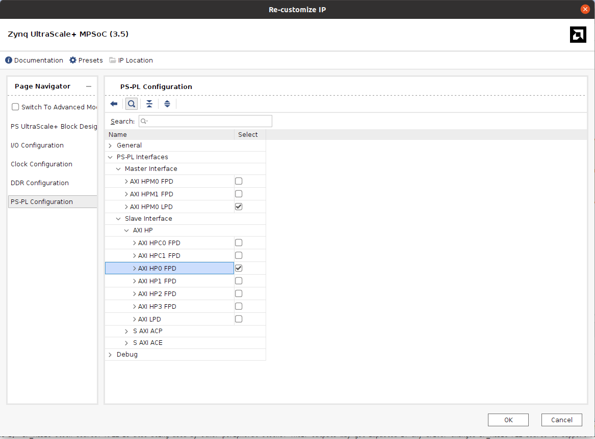
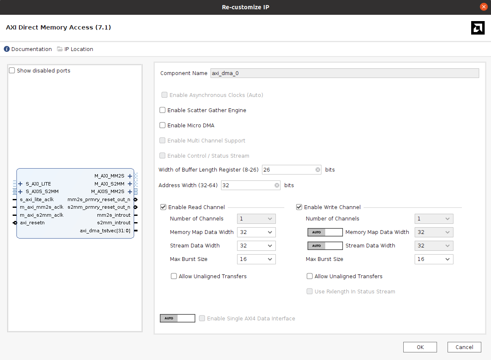
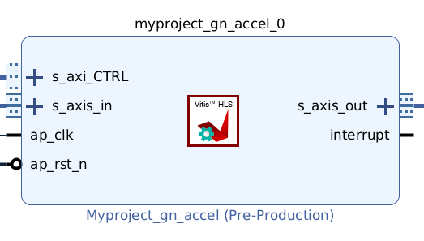
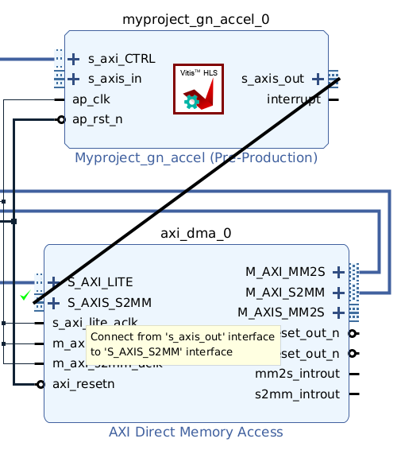
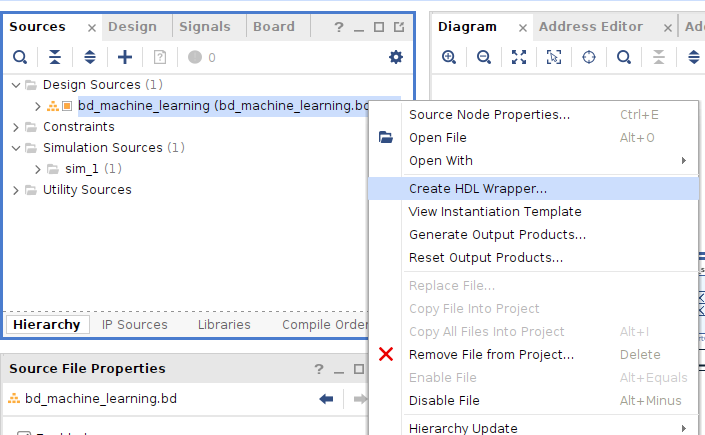
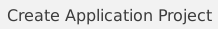
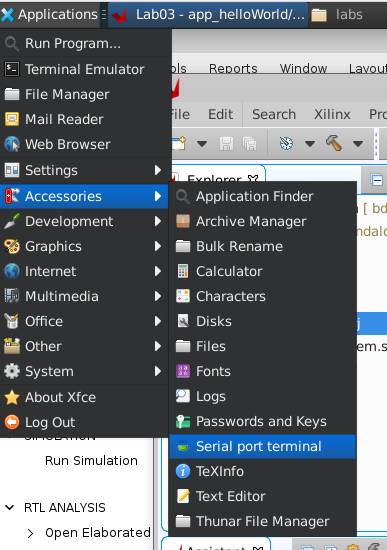
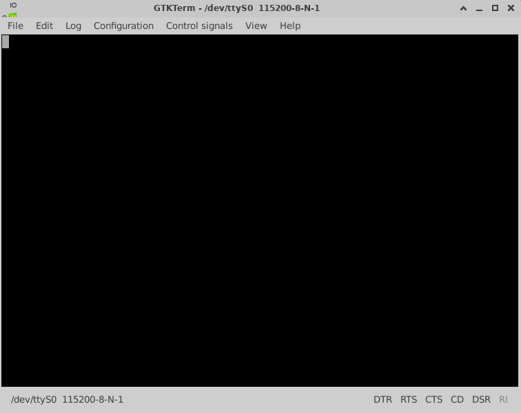
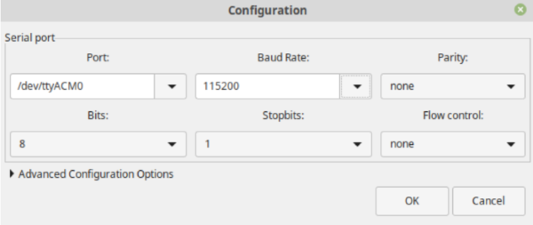

# Hello world desde Zynq!

### 1.1. Introducción

Este laboratorio te guiará en la creación del clásico Hello World para System-On-Chip basado en FPGA. 

### 1.2. Objetivos

- Adquirir conocimientos sobre el flujo de diseño SoC-FPGA utilizando la plataforma de software unificada Vitis.
- Crear el hardware para configurar la parte FPGA del SoC y configurar el PS.
- Crear la aplicación en 'C' (en Vitis) que se ejecutará en el PS.
- Probar el diseño completo en la plataforma Ultra96-V2 para verificar el funcionamiento (Vitis y puerto serie).

## 2. Hardware

### 2.1. Proyecto de Vivado

1.   Abrir _Vivado 2022.2_.

2.   Desde el menu **Quick Start**, clic en  para iniciar el asistente o haga clic en**File → Project → New**. Verá el cuadro de diálogo  **Create A New Vivado Project** en la ventana **New Project** . Haga clic en **Next**. Utilice la información de la siguiente tabla para configurar las diferentes opciones del asistente:

| Opcion | Propiedad del sistema | Configuracion | 
|---------------|-----------------|----------|
| Project Name | Project Name | Lab-hello-world |  
  | Project Location | `<directory>` |
|  | Create Project Subdirectory | Check this option. | 
| clic **Next** |  |  |  
| Project Type | Project Type | Select **RTL Project**. Keep  unchecked the option `do not specify sources at this time`.  | 
| clic **Next** |  |  | 
| Add Sources | Do nothing |  |  
| clic **Next** |  |  |  
| Add Constraints | Do Nothing |  |  
| clic **Next** |  |  |  
| Default Part | Specify | Select **Boards** |  
|  | Board | Select **Ultra96-V2 Single Board Computer** |  
| clic **Next** |  |  |  
| New Project Summary | Project Summary | Review the project summary |  
| clic **Finish** |  |  | 

Después de hacer clic en **Finish**, el **New Project Wizard** se cierra y el proyecto creado se abre en la interfaz principal de Vivado, que está dividida en dos secciones principales: **Flow navigator** y **Project Manager**. En el área de Project manager, se puede ver el **Project Summary**, donde se presentan la configuración, la parte de la placa seleccionada y los detalles de la síntesis. Para más detalles, haga clic [aquí](https://china.xilinx.com/support/documents/sw_manuals/xilinx2022_2/ug892-vivado-design-flows-overview.pdf). 

Al seleccionar la plataforma **Ultra96-V2**, el **IP Integrator** reconoce la placa y asignará automáticamente los puertos de E/S del PS a las ubicaciones de pines físicos correspondientes a los periféricos específicos de la placa cuando se utilice el asistente **Run Connection**. Además de establecer restricciones de pines (pin constraint), el **IP Integrator** también define el estándar de E/S (LVCMOS 3.3, LVCMOS 2.5, etc.) para cada pin de E/S, ahorrando tiempo al diseñador en este proceso.

3. Click **Create Block Design** in the **Flow Navigator** pane under the **IP Integrator**.

  

4.  In the **Create Block Design** popup window, set the **Design Name** as *bd_gpio* and leave the other options as default.

  

In the main GUI, on the **Block Design** section, a new blank Diagram canvas will be presented, which will be used to create the hardware design to be implemented on the Zynq device.

5. The first step is to add the ZYNQ7  **Processing System (PS)** block. To do this, either click the **Add IP** icon  located on the toolbar in the Diagram section, or right-click on the blank canvas area and select **Add IP** from the available options.

  

A small window will come up showing the available **IPs** (they are the Intellectual Property cores that are already available). To search for the **PS7 IP** core, either scroll to the bottom of the IP list or use the search bar with the keyword **zynq**. Double click on the **Zynq UltraScale+ MPSoC** to select it and add it to the canvas. 

The **Zynq UltraScale+ MPSoC** block will then appear in the block diagram canvas. The I/O ports visible on the block are defined by its default configuration settings.

  

6. Click **Run Block Automation**, available in the green information bar.

  

7. Then, in the **Run Block Automation** window, select **zynq_ultra_ps_e_0**. Make sure **Apply Board Presets** is **checked**, and leave everything else as default. Click **OK**.

8. Double click in the **Zynq UltraScale+ MPSoC** block to open the Processing System **Re-customize IP** window **All the necessary configurations for the processing unit are completed in this section**. 

	The **Zynq UltraScale+ MPSoC block design** illustration should now be visible, displaying the various configurable sections of the Processing System. Remember, the green blocks represent the configurable components.

  

9. Click on the **PS-PL Configuration** at the **Page Navigator** pane. Expand **PS-PL interfaces** and verify that the AXI HPM0 LPD is checked. Then, expand **Slave Interface/AXI HP** and select AXI HP0 FPD.

  

10. Click on the **Clock Configuration** option and expand **PL Fabric Clocks**. Verify that **FCLK_CLK0** is enabled and its frequency is set to 100 MHz. **This section defines the clock frequency for the PL (Programmable Logic) digital design**.

11. Finish with the **PS** configuration by clicking the  button in the **Re-Customize** IP window.

12. Add the **AXI Direct Memory Access (DMA)** IP core. 

  

13. Once it has been added to the block design, double-click on the IP core and configure it as shown in the following figure.

  

14. Click **Run Connecton Automation**. In the pop-up window click **Ok**. 

  

15. Add the inference IP core. To do so, in the **Flow Navigator** pane, go to  the **Project Manager** area and click on **Settings**.

16.  Navigate to **IP → Repository**, click **Add Repository**, and select , and select **day-3/hello-wolrd/ip** folder.

> **Note:**  
> If you generated the IP using hls4ml, make sure to select the output directory that contains the IP definition files.

17.  Add the IP core to the block design. For this project, search for **`myproject_gn_accel`**. 

  

18. Execute Run Connection Automation. 

19. Perform the following connections 

  

  

Finally, the complete block design is illustrated in the following figure. 

20. The next step is to create the HDL wrapper.Go to **Sources** under the **Design Sources** folder, right-click on **`bd_machine_learning`**, and select **Create HDL Wrapper**, as shown in the following figure.

  

21. Once the HDL wrapper has been generated, click on **Run Bitstream**.  
Vivado will display a dialog indicating that no synthesis results are available. Click **Yes** to allow Vivado to run synthesis. The tool will then automatically proceed with **implementation** and **bitstream generation**.

22. After the bitstream generation is complete, export the hardware design.
Go to **File → Export → Export Hardware**. 
In the export dialog, make sure that **Include bitstream** is enabled and use the name **bd_helloWorld_wrapper** for the .xsa file, and complete the export process. This will generate the `.xsa` file required for the next steps. 

## 3. Software

### 3.1. Launch Vitis IDE and Configure the Workspace

1. In Vivado, launch Vitis IDE by clicking **Tools > Launch Vitis IDE**. The Launch Vitis IDE dialog will open, prompting for the workspace directory. Click **Browse** to specify the workspace directory. **As a recommendation, use the same directory as your project.**

## 3.2. Vitis Application Project

In this section, you will create the 'C' application project and the code to use the hardware design.

1. Select **File -> New -> Application Project** or click  in the main window. To create the new application, use the following information:

| Wizard Screen | System Property | Setting |
|---------------|-----------------|---------|
| Create a New Application Project | | |
| click **Next** | | |
| Platform | click **Create a new platform from hardware** | |
| | XSA File: | Browse: **bd_helloWorld_wrapper.xsa** \* |
| click **Next** | | |
| Application Project Details | Application project name | app_helloWorld |
| click **Next** | | |
| Domain | Name: | standalone_psu_cortex53_0 |
| | Display Name: | standalone_psu_cortex53_0 |
| | Operating System: | standalone |
| | Processor: | psu_cortex53_0 |
| | Architecture: | 32-bit |
| click **Next** | | |
| Templates | Available Templates: | Hello World |
| click **Finish** | | |

> **\*** Remember that the **XSA** file was exported to your project folder.

After clicking **Finish**, the **New Application Project Wizard** closes and the created project opens in the main Vitis interface, which is divided into the following sections: Explorer, Assistant, Project Editor, and Console. In the Explorer and Assistant views, you will see two created items:  application and  platform project.

## 4. Testing

### 4.1. Development Board Setup

In this section, you will learn the steps to connect the Ultra96-V2 to the PC and run the 'C' application you just wrote.

1. Connect a micro USB cable between the Linux host machine and the **JTAG** port of the Ultra96-V2 development board expander module. This connection will be used to configure the PL.

2. Connect the power cable from the 12V AC/DC converter to the Ultra96-V2 power connector.

### 4.2. Serial Communication Software Setup

1. **GTKTerm** will be used to establish serial communication between the host machine and the Ultra96-V2. To configure GTKTerm, open the software by clicking **Applications -> Accessories -> Serial port terminal**.

{width=50%}

A window similar to the one shown below will appear:

2. Click **Configuration > Port** and select port **ttyUSB1** with Baud Rate **115200**.

{width=50%}

### 4.3. Running the Application

1. In Vitis, right-click on *app_helloWorld*, then select **Run -> Run As -> Launch on Hardware (Single application debug (GDB))** to reconfigure the FPGA and run the compiled code on the PS.

2. Switch back to the **GTKTerm** window. If everything works correctly, you should see the application output in the remote serial console.

